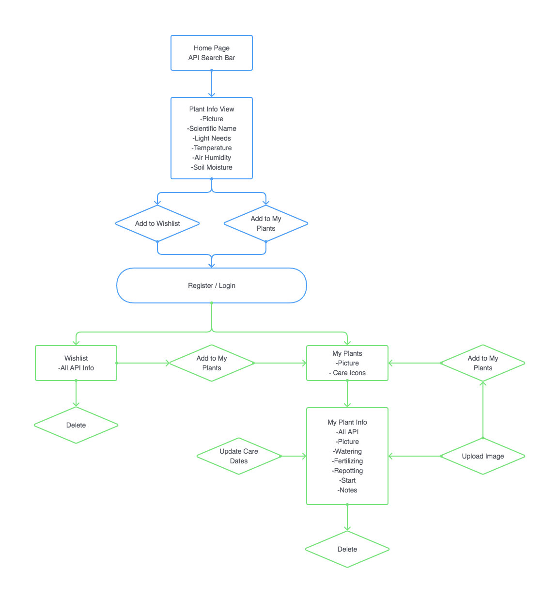
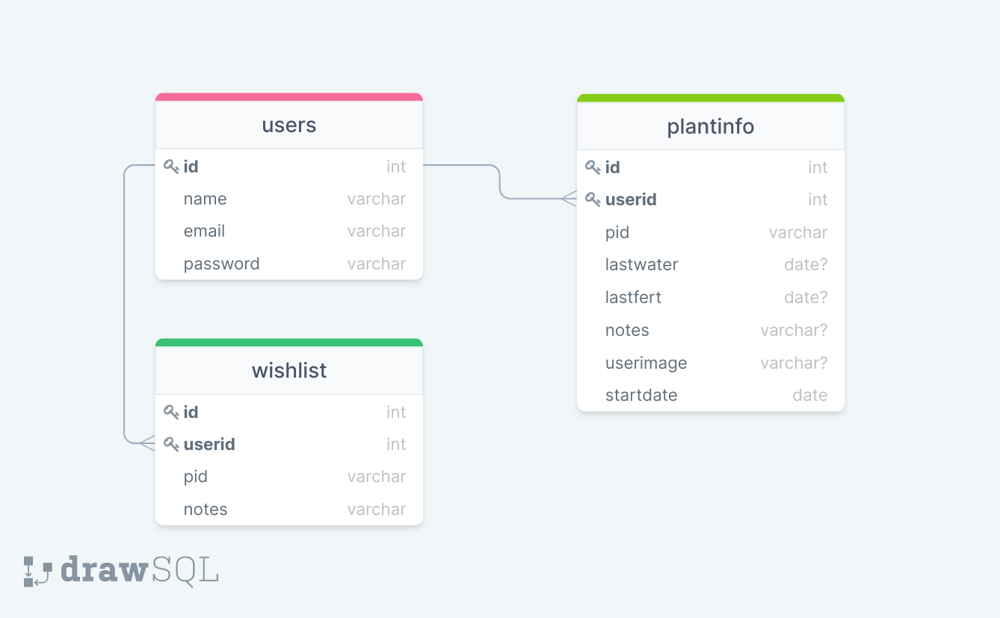

# FS-17 Team 1 - Plant Overgrow

This is a team project by Cristina, Deborah and Laura.

## Set up

To get started, run `npm install`, followed by `npm start` in the project folder.
Repeat the same step in the client folder.

In order to generate the API token, register at [Open Plant Book](https://open.plantbook.io/). The token has a lifecycle of 24 hours.

## Technologies used

- Express
- mySQL
- React
- [External API](https://open.plantbook.io/)
- Bootstrap
- Luxon
- CSS
- JSON web token
- bcrypt

## User flow

## Database schema

## Notes

_This is a student project that was created at [CodeOp](http://codeop.tech), a full stack development bootcamp in Barcelona._
_Thanks to our instructor Jim for the project name._
