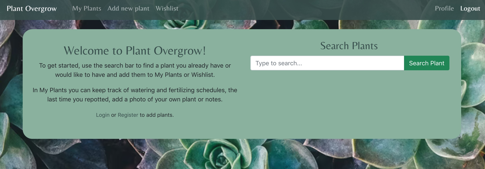
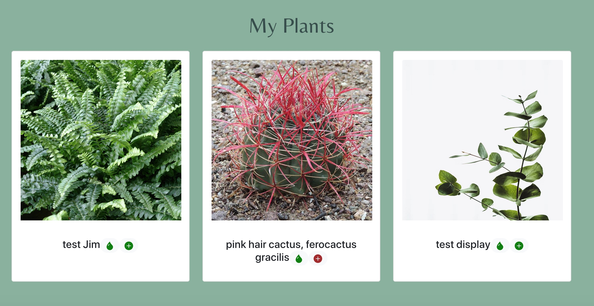

# FS-17 Team 1 - Plant Overgrow

This is a 2 week team project by Cristina, Deborah and Laura.

Full stack app for users to keep track of the care needs of their house plants and add plants to their wishlist.

Deborah's main responsabilities included:

- Enabling User Registration, User Login and role based data access by implementing Authentication and Authorisation using JSON Web Tokens (generating tokens), bcrypt (password hashing)
- Allowing users to upload their own plant photos and manage plant information by creating frontend components performing GET, POST, PATCH calls.
- Optimising display of plant data with Bootstrap and custom CSS.

## Set up

To get started, run `npm install`, followed by `npm start` in the project folder.
Repeat the same step in the client folder.

In order to generate the API token, register at [Open Plant Book](https://open.plantbook.io/). The token has a lifecycle of 24 hours.

## Technologies used

- Express
- mySQL
- React
- [External API](https://open.plantbook.io/)
- Bootstrap
- Luxon
- CSS
- JSON web token
- bcrypt

## User flow

## Database schema

## Notes

_This is a student project that was created at [CodeOp](http://codeop.tech), a full stack development bootcamp in Barcelona._
_Thanks to our instructor Jim for the project name._
